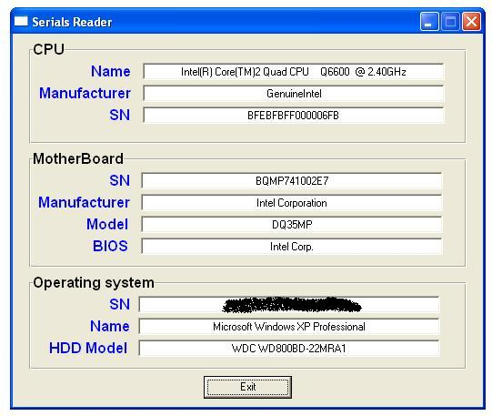



## Serials Reader

### Description

Protect your application from being executed on unauthorized machines. Read many serials from PC like Motherboard, CPU, Windows, HDD
 
### More Info
 

             |
---                |---
**Submitted On**   |2008-09-14 21:52:24
**By**             |[VBtutor](https://github.com/Planet-Source-Code/PSCIndex/blob/master/ByAuthor/vbtutor.md)
**Level**          |Intermediate
**User Rating**    |4.5 (18 globes from 4 users)
**Compatibility**  |VB 6\.0
**Category**       |[Miscellaneous](https://github.com/Planet-Source-Code/PSCIndex/blob/master/ByCategory/miscellaneous__1-1.md)
**World**          |[Visual Basic](https://github.com/Planet-Source-Code/PSCIndex/blob/master/ByWorld/visual-basic.md)
**Archive File**   |[Serials\_Re2126889142008\.zip](https://github.com/Planet-Source-Code/vbtutor-serials-reader__1-71084/archive/master.zip)

